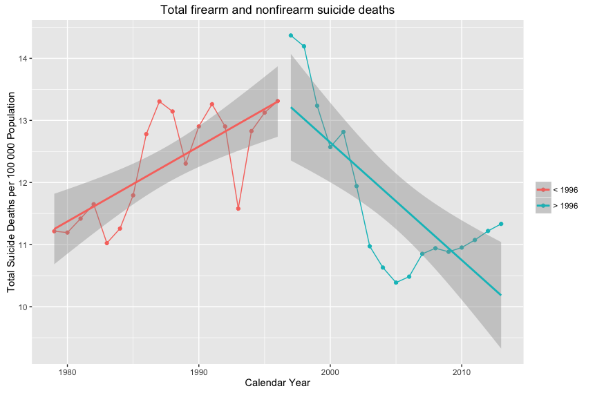

```{r, echo=FALSE, message=FALSE, warning=FALSE}
library(readr)
library(magrittr)
library(dplyr)
library(knitr)
library(ggplot2)
library(MASS)
```

## EDA
```{r}
read_csv("../inst/extdata/AUdeaths_corrected_10-11-2016.csv") %>%
  glimpse()
```

## Table 2
```{r}
read_csv("../inst/extdata/AUdeaths_corrected_10-11-2016.csv") %>%
  mutate(rate = round(suicidetotal / personyearsatrisk * 100000, 2)) %>%
  group_by(year) %>%
  summarise("No." = suicidetotal, "Crude Rate per 100 000 Population" =  rate) %>%
  kable(caption = "Suicide Total Deaths")
```

# Figure I
```{r, eval=FALSE}
read_csv("./inst/extdata/AUdeaths_corrected_10-11-2016.csv") %>%
  mutate(rate = suicidetotal / personyearsatrisk) %>%
  mutate(law = ifelse(year > 1996, "> 1996", "< 1996"))
  ggplot(aes(year, rate * 100000)) +
    geom_point(aes(colour = factor(law))) +
    geom_line(aes(colour = factor(law))) +
    geom_smooth(aes(colour = factor(law)), method = lm) +
    labs(title = "Total firearm and nonfirearm suicide deaths",
         x = "Calendar Year",
         y = "Total Suicide Deaths per 100 000 Population",
         colour = "")
```



## Model A
```{r}
model_a <- read_csv("../inst/extdata/AUdeaths_corrected_10-11-2016.csv") %>%
  mutate(law = ifelse(year > 1996, "> 1996", "< 1996")) %>%
  mutate(law = as.factor(law)) %>%
  filter(law == "< 1996") %>%
  glm.nb(suicidetotal ~ year + offset(log(personyearsatrisk)), data = .)

estimate <- coef(model_a) %>% exp() %>% round(digits = 3) %>% matrix()
confint <- confint(model_a) %>% exp() %>% round(digits = 3)
cbind(estimate, confint) %>% kable()
```

## Model B
```{r}
model_b <- read_csv("../inst/extdata/AUdeaths_corrected_10-11-2016.csv") %>%
  mutate(law = ifelse(year > 1996, "> 1996", "< 1996")) %>%
  mutate(law = as.factor(law)) %>%
  filter(law == "> 1996") %>%
  glm.nb(suicidetotal ~ year + offset(log(personyearsatrisk)), data = .)

estimate <- coef(model_b) %>% exp() %>% round(digits = 3) %>% matrix()
confint <- confint(model_b) %>% exp() %>% round(digits = 3)
cbind(estimate, confint) %>% kable()
```

## Model C
```{r}
model_c <- read_csv("../inst/extdata/AUdeaths_corrected_10-11-2016.csv") %>%
mutate(law = ifelse(year > 1996, "> 1996", "< 1996")) %>%
mutate(law = as.factor(law)) %>%
mutate(year = year - 1996) %>%
glm.nb(suicidetotal ~ year + law + year * law + offset(log(personyearsatrisk)), data = .)

estimate <- coef(model_c) %>% exp() %>% round(digits = 3) %>% matrix()
confint <- confint(model_c) %>% exp() %>% round(digits = 3)
cbind(estimate, confint) %>% kable()
```
